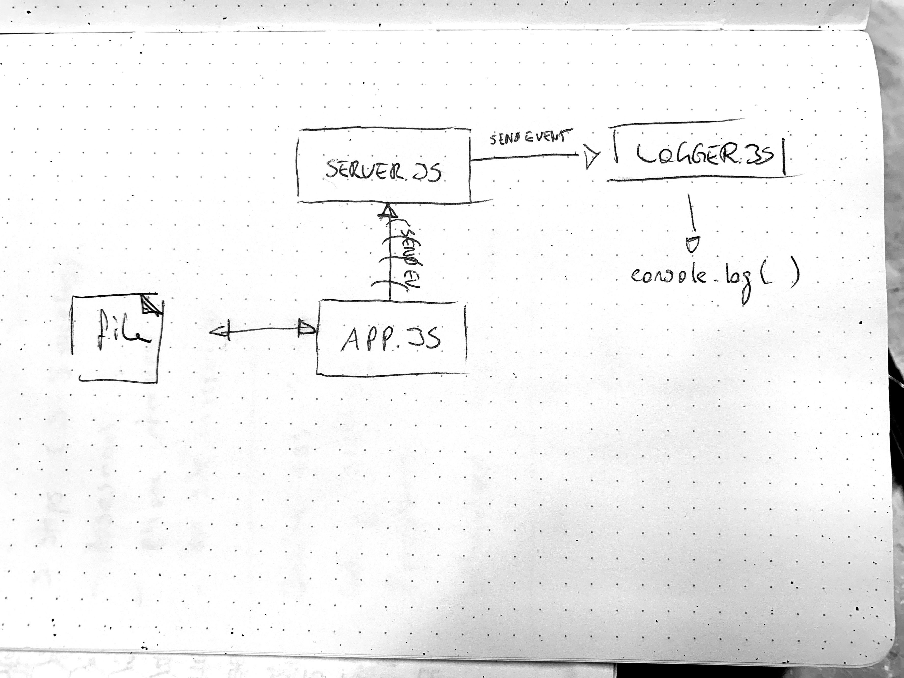

# LAB - 18

## Socket.io

### Author: Joé Jemmely

### Links and Resources

- [submission PR](https://github.com/401-advanced-javascript-joejemmely/lab-18/pull/1)
- [travis](https://travis-ci.com/401-advanced-javascript-joejemmely/lab-18)

### Documentation

## alterFile(file)

Async function to read, transform, and write

**Kind**: global function

| Param | Type            |
| ----- | --------------- |
| file  | <code>\*</code> |

## constant

**Properties**

| Name       |
| ---------- |
| PORT       |
| SERVER_URL |

## events

**Properties**

| Name  |
| ----- |
| SAVE  |
| ERROR |

### Setup

#### `.env` requirements

- `PORT` - (_3000_)
- `SERVER_URL` - (_http://localhost_)

#### Running the app

!!! Run each of the command below in a new terminal and in the order they appear !!!

- `npm run server`
- `npm run logger`
- `npm run client <filename.ext>`

#### Tests

- How do you run tests? `npm test`

### UML

